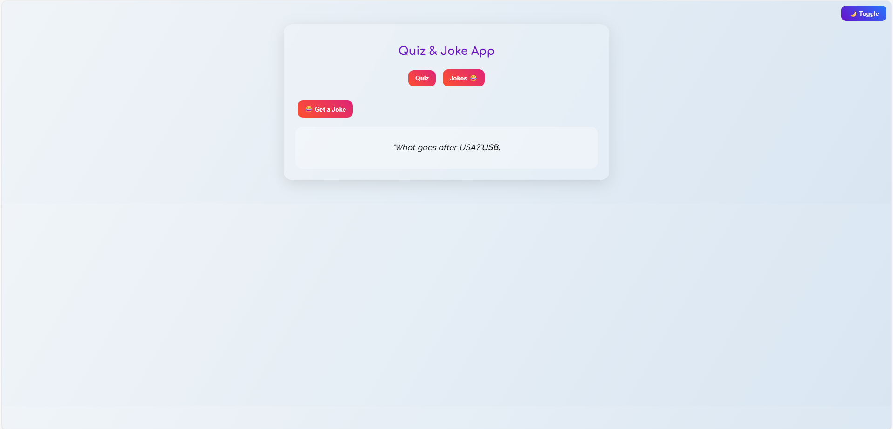

#  Quiz & Joke App  

A stylish **Quiz + Joke Web App** built using **HTML, CSS, and JavaScript**.  
This project was created as part of my **ApexPlanet training task**.   

##  Features  
 **Quiz Section**  
- Multiple-choice quiz questions  
- Timer (30 seconds per question)  
- Progress bar tracking  
- Score calculation with review of answers  
- Confetti celebration  (full sprinkle for 100%, half for 50%+)  

 **Joke Section**  
- Fetches live jokes from the [Official Joke API](https://official-joke-api.appspot.com/random_joke)  
- Fun punchline reveal  

**UI Features**  
- Modern glassmorphism design  
- Light/Dark theme toggle  
- Responsive for mobile & desktop  

---


---

## Tech Stack  
- **HTML5**  
- **CSS3** (Glassmorphism + Responsive Design)  
- **JavaScript (ES6)**  
- **Canvas Confetti JS** for celebrations  

---

##  Screenshots  
### Quiz Page  
  

### Joke Page  
  

---

##  Installation  
1. Clone the repo:  
   ```bash
   git clone https://github.com/Preetha234M/quiz-joke-app
   ```
2. Open `index.html` in your browser.  
3. Enjoy  

---

##  Author  
**Preetha**  
> Built with  as part of **ApexPlanet Training**  

 Connect with me on [LinkedIn](https://www.linkedin.com/in/preetha-m-788011363)  
